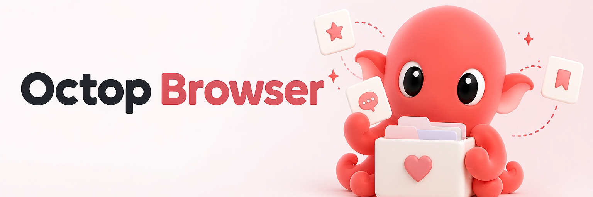

<p align="center">
  
</p>

<p align="center">
  <strong>Agent-first lightweight browser automation — direct CDP, no Playwright, more accurate and more reliable.</strong>
</p>

<p align="center">
  <a href="https://www.python.org/downloads/"></a>
  <a href="https://github.com/TencentCloud/octop-browser/blob/main/LICENSE"></a>
  <a href="https://pypi.org/project/octop-browser/"></a>
  <a href="https://github.com/astral-sh/ruff"></a>
  <a href="https://github.com/TencentCloud/octop-browser"></a>
</p>

<p align="center">
  <a href="#-overview">Overview</a> ·
  <a href="#-highlights">Highlights</a> ·
  <a href="#-core-technology">Core Technology</a> ·
  <a href="#-features">Features</a> ·
  <a href="#-quick-start">Quick Start</a> ·
  <a href="#-contents">Contents</a>
</p>

<p align="center">
  <b>English</b> · <a href="README_CN.md">中文</a>
</p>

---

## 📌 Overview

**Octop Browser** is a lightweight browser-use style tool that makes an agent's browser usage **more accurate and reliable**. Unlike typical stacks that route every action through Playwright, it launches a real Chromium and talks to the **Chrome DevTools Protocol (CDP) directly** — removing the intermediate layer so element targeting is driven by stable, live DOM refs and rarely misses.

Under the hood it starts a Chromium process with a `--remote-debugging-port` and speaks CDP itself. Because element references come straight from the live page, the agent acts on the *real* nodes, and those refs stay valid through reflows and re-renders — the result is higher action accuracy and lower token usage, with a persistent profile so logins don't expire mid-task.

> Octop Browser's design goal: give an agent a browser it can act on with confidence — accurate clicks, low token cost, and persistent logins — through a small, well-shaped set of tools and a matching CLI.

*Note:* the `install-browser` command may bootstrap Playwright **once** purely to download a Chromium binary. Playwright is **not** a runtime dependency — the agent always drives the browser over CDP.

## ✨ Highlights

| | Feature | Description |
|---|---------|-------------|
| ⚡ | **Direct CDP** | Connects straight to Chrome via CDP — no Playwright / intermediate layer |
| 🎯 | **Ref-based targeting** | Stable element refs survive layout reflows, so clicks land where intended |
| 🪶 | **Lightweight DOM** | Token-efficient multi-level DOM keeps prompts small |
| 🔐 | **Auth persistence** | Profile-based logins persist across sessions — no repeated sign-in |
| 🛠️ | **Agent tools** | One stateless `browser_tool` with ~20 actions |
| 💻 | **CLI** | Every action available as a first-class command |
| 🎬 | **Record & replay** | Capture a workflow, then replay it as skill-guided agentic execution |
| 🤖 | **MCP server** | Expose the browser to any MCP-capable agent |

## 🧠 Core Technology

| Layer | Technology |
|-------|-----------|
| **Language** | Python 3.11+ |
| **Transport** | CDP over `websockets` (hand-rolled async client) |
| **Launcher** | `subprocess` Chromium with `--remote-debugging-port` |
| **DOM** | Multi-level builder + stable `ref` system |
| **Tools** | Stateless `browser_tool` action set |
| **Recording** | Injected JS recorder + semantic collapse + skill generator |
| **Interfaces** | CLI + MCP server |
| **Build / quality** | hatchling · ruff · mypy · pytest |

## 🤔 Features

### Browser tools

`browser_tool(action=...)` exposes the following actions:

| Action | Description | Action | Description |
|--------|-------------|--------|-------------|
| `navigate` | Navigate the active tab | `select` | Pick a `<select>` option |
| `dom_tree` | Dump the multi-level DOM | `scroll` | Scroll the viewport |
| `screenshot` | Capture a screenshot | `hover` | Hover an element |
| `click` | Click by ref | `eval_js` | Run JavaScript |
| `type` | Type text by ref | `go_back` / `go_forward` | History nav |
| `fill` | Fill a field by ref | `reload` | Reload the page |
| `press` | Press a key | `new_tab` / `close_tab` | Tab control |
| `wait` | Wait for a condition | `switch_tab` / `list_tabs` | Tab management |
| | | `close_session` | Close the CDP connection (pass `kill=True` to also stop Chrome) |

### CDP session
- `BrowserSession.create(profile=...)` opens a persistent Chromium session.
- Stateless helper: `browser_tool(action="navigate", url=..., profile="work")`.
- Set `BROWSER_USE_IDLE_TIMEOUT_MINUTES` to stop a local Chrome profile after
  that many minutes without real CDP activity (`0`, the default, disables it).
- `await session.close(kill=True)` or
  `browser_tool(action="close_session", profile="work", kill=True)` stops the
  local Chrome process immediately. Profile data and login state stay on disk.

### CLI
Every tool is also a CLI command:

```bash
octop-browser install-browser     # fetch a Chromium binary (one-time)
octop-browser navigate "https://example.com" --profile work
octop-browser dom-tree --profile work
octop-browser click --ref inp_1 --profile work
octop-browser type "octop" --ref inp_1 --profile work
octop-browser screenshot --profile work
octop-browser close-session --kill --profile work   # also stop Chrome
# session: open / close-session / new-tab / switch-tab / close-tab / list-tabs
```

### Record & replay
Octop Browser can **record** a real browsing session and **replay** it:

1. `octop-browser record daemon-start` — launch the long-lived recording daemon.
2. `octop-browser record start` — begin capturing the active tab.
3. Browse normally. A small injected script captures clicks, typed text, navigations, and submits, with privacy redaction of sensitive fields.
4. `octop-browser record stop` — stop capturing.
5. `octop-browser record generate-steps <id>` — inspect the semantic steps; `record generate-skill <id>` emits a draft **Skill** (`draft.skill.md`).
6. `octop-browser replay run <id>` — re-execute as **skill-guided agentic** execution (the model replays intent, not brittle coordinates/refs).

Use `record list` / `record show <id>` / `record status` / `record doctor` to manage recordings.

### MCP server
`octop-browser` ships an MCP server, so any MCP-capable agent can drive the browser through the same tool set.

```bash
python -m octop_browser.mcp_server   # or: make mcp
```

It speaks MCP over stdio, which is the transport most agent clients expect.

Over MCP each action is exposed as its own tool named after it — `browser_navigate`,
`browser_click`, `browser_dom_tree`, `browser_close_session`, `browser_record_start`,
`install_browser`, … — rather than as a single dispatching tool. Arguments match the
Python API, so `browser_close_session` also takes `kill` to terminate Chrome.

### Agent skills
The `skills/` directory ships ready-made Skill files for agents that support
skill loading — `skills/octop-browser/SKILL.md` (English) and
`skills/octop-browser-zh/SKILL.md` (Chinese). They encode the safe usage
pattern: run `dom-tree` before every `click`, pass `ref`s instead of
coordinates, and reuse named profiles for login state. `record generate-skill`
emits a draft Skill in the same format.

## 🚀 Quick Start

### Prerequisites
- **Python 3.11+** — verified on 3.11 and 3.12. Higher-level applications built
  on top of it (e.g. Octop) may require a newer Python; follow their own docs.
- A Chromium / Chrome binary (auto-downloaded by `install-browser`)

### 1. Install

```bash
pip install octop-browser
octop-browser install-browser    # fetch a Chromium binary once
```

### 2. Use as a library

```python
from octop_browser import BrowserSession

async with await BrowserSession.create(profile="default") as session:
    await session.navigate("https://example.com")
    dom = await session.dom_tree()
    await session.click(ref="btn_1")
```

Or statelessly:

```python
from octop_browser import browser_tool

await browser_tool(action="navigate", url="https://example.com", profile="work")
```

### 3. Use as a CLI

```bash
octop-browser navigate "https://example.com" --profile work
octop-browser dom-tree --profile work
```

### 4. Record a workflow

```bash
octop-browser record daemon-start
octop-browser record start
# ... interact with the page ...
octop-browser record stop
octop-browser record generate-skill <recording_id>   # emit a draft Skill
octop-browser replay run <recording_id>              # replay it
```

## 📑 Contents

- [Overview](#-overview)
- [Highlights](#-highlights)
- [Core Technology](#-core-technology)
- [Features](#-features)
- [Quick Start](#-quick-start)
- **Reference**
  - [CLI reference](#-cli-reference)
  - [Python API](#-python-api)
  - [Configuration](#-configuration)
  - [Development](#-development)
- **Project Info**
  - [Contributing](#-contributing)
  - [Related projects](#-related-projects)
  - [License](#-license)

## 📖 CLI reference

| Command | Description |
|---------|-------------|
| `install-browser` | Download a Chromium binary (one-time bootstrap) |
| `navigate` | Navigate the active tab to a URL |
| `open` | Start a session and open one or more URLs as separate tabs |
| `dom-tree` | Print the multi-level DOM |
| `screenshot` | Capture a screenshot |
| `click` / `type` / `fill` / `press` | Interact by ref |
| `wait` / `select` / `scroll` / `hover` | Page control |
| `eval-js` | Run JavaScript |
| `go-back` / `go-forward` / `reload` | History / reload |
| `new-tab` / `switch-tab` / `close-tab` / `list-tabs` | Tab management |
| `close-session` | Detach from a profile's CDP session. Chrome keeps running so a later command re-attaches; add `--kill` to terminate it and free its port |
| `record ...` | `doctor`, `daemon-start`, `daemon-stop`, `status`, `start`, `stop`, `list`, `show`, `generate-steps`, `generate-skill` |
| `replay run <id>` | Replay a recorded workflow |

### Record & replay options

| Option | Values | Purpose |
|--------|--------|---------|
| `record start --privacy` | `none` · `mask-sensitive` *(default)* · `mask-all` | Redact typed values before they are written to disk. `mask-sensitive` masks fields that look sensitive (`password`, `token`, `secret`, `otp`, `jwt`, … matched against the field's type / name / id / placeholder / label); `mask-all` masks every typed value |
| `replay run --input key=value` | repeatable | Supply a value for a `{{placeholder}}` step at replay time |

Redacted values are stored as the placeholder `{{sensitive_value}}`, so a recording that
captured a login can still be replayed safely — keep the secret in the environment and
pass it in at replay time:

```bash
octop-browser replay run <recording_id> --input sensitive_value="$MY_PASSWORD"
```

### DOM levels

`dom-tree` (and the `dom_tree` action) takes `--level` to trade detail for tokens:

| Level | Cost | Contents |
|-------|------|----------|
| `minimal` | ~50 tokens | Title / URL only |
| `interactive` *(default)* | ~200–500 | Clickable / typeable elements with `ref`s |
| `full` | ~1k–3k | Full readable page |
| `structured` | varies | JSON, for programmatic use |

```bash
octop-browser dom-tree --level minimal      # cheap page check
octop-browser dom-tree --level structured   # JSON for scripts
```

## 🐍 Python API

### Exports

Everything below is importable from the package root: `from octop_browser import ...`

| Symbol | Kind | Purpose |
|--------|------|---------|
| `BrowserSession` | class | Persistent CDP session — `await BrowserSession.create(profile="work")` |
| `browser_tool` | async fn | Stateless one-shot action — `await browser_tool(action="click", ref="btn_1")` |
| `ToolResult` | model | Return value of every session method and `browser_tool()` |
| `ActionMetrics` | model | Per-action timing / token counters |
| `TabInfo` | model | One tab: `tab_id` · `url` · `title` · `active` |
| `OctopSettings` | model | Full settings object — pass via `BrowserSession.create(settings=...)` |
| `settings` | instance | Process-wide default, built from the environment at import time |
| `BrowserMode` | type | `Literal["auto", "headed", "headless"]` |
| `chromium_executable` | fn | Path of the managed Chromium binary, or `None` if absent |
| `ensure_chromium` | fn | Blocking install — returns `True` once a binary is ready |
| `install_chromium_stream` | async gen | Same install as an event stream, for progress UIs |
| `InstallEvent` | TypedDict | One install event: a `log` line, or terminal `done` / `success` / `error` |

### Tool results

Every session method and `browser_tool()` call returns a `ToolResult`:

| Field | Type | Notes |
|-------|------|-------|
| `success` | `bool` | `False` means the action failed — inspect `error` |
| `content` | `str` \| `dict` | Main payload: DOM text, screenshot path, JS return value, … |
| `error` | `str` \| `None` | Failure reason; `None` on success |
| `metrics` | `ActionMetrics` | `action` · `duration_ms` · `dom_nodes_scanned` · `estimated_tokens` · `screenshot_size_kb` |
| `metadata` | `dict` \| `None` | Optional side-channel — e.g. `screenshot` reports page url / title here |

```python
res = await session.dom_tree(level="interactive")
if res.success:
    print(res.content, res.metrics.estimated_tokens)
```

`session.metrics_summary()` aggregates running totals for the whole session.

### Hooks

`BrowserSession` mixes in `HooksMixin`, so callbacks can observe every action:

```python
@session.on("after_action")
async def log_metrics(metrics):  # metrics: ActionMetrics
    print(metrics.action, metrics.duration_ms)
```

| Event | Payload | Fired |
|-------|---------|-------|
| `before_action` | `dict` — `{"action": str, "params": dict}` | Before each action is dispatched |
| `after_action` | `ActionMetrics` | After an action succeeds |
| `action_error` | `ToolResult` | After an action returns `success=False` |
| `page_navigated` | — | Reserved: accepted by `on()`, not emitted yet |

Callbacks may be sync or async, and an exception inside a hook is logged without
breaking the action.

## ⚙️ Configuration

Every setting is read from the environment at import time. You can also build a
`OctopSettings` object explicitly and hand it to `BrowserSession.create()`:

```python
from octop_browser import BrowserSession, OctopSettings

settings = OctopSettings(cdp_port_start=9300, cdp_timeout=60.0)
session = await BrowserSession.create(profile="work", settings=settings)
```

| Variable | Default | Purpose |
|----------|---------|---------|
| `BROWSER_USE_MODE` | `auto` | Launch mode: `auto` / `headed` / `headless` (auto picks headed on macOS/Windows or when `DISPLAY` is set) |
| `BROWSER_USE_CDP_WS_URL` | *(unset)* | Connect straight to an existing Chrome DevTools WebSocket URL — use this for remote / Docker Chrome and skip the launcher |
| `BROWSER_USE_CHROME_BIN` | auto-detect | Absolute path to the Chrome / Chromium binary |
| `BROWSER_USE_PROFILES_DIR` | `~/.octop-browser/profiles` | Base directory for Chrome user-data-dirs |
| `BROWSER_USE_SCREENSHOTS_DIR` | `~/.octop-browser/screenshots` | Where the `screenshot` action writes PNGs |
| `BROWSER_USE_CDP_HOST` | `localhost` | Host serving Chrome's CDP endpoint |
| `BROWSER_USE_CDP_PORT_START` | `9222` | First CDP debug port assigned to profiles |
| `BROWSER_USE_CDP_TIMEOUT` | `30.0` | Seconds to wait for a CDP command response |
| `BROWSER_USE_VIEWPORT_WIDTH` | `1440` | Viewport width in CSS pixels |
| `BROWSER_USE_VIEWPORT_HEIGHT` | `900` | Viewport height in CSS pixels |
| `BROWSER_USE_IDLE_TIMEOUT_MINUTES` | `0` (off) | Stop a locally managed Chrome after N minutes without real CDP activity |
| `BROWSER_USE_LAUNCH_RETRIES` | `20` | How many times to poll Chrome after launch |
| `BROWSER_USE_LAUNCH_DELAY` | `0.25` | Seconds between launch polls |
| `BROWSER_USE_CDP_MAX_MESSAGE_SIZE` | `33554432` (32 MiB) | Max CDP WebSocket frame size; `0` disables the cap (raise it for very large screenshots) |
| `BROWSER_USE_NO_SANDBOX` | auto-detect | Force (`1`) or forbid (`0`) `--no-sandbox`. When unset, it is added only if the kernel denies unprivileged user namespaces (typical in containers) |
| `BROWSER_USE_DISABLE_GPU` | auto (on in headless) | Force (`1`) / forbid (`0`) `--disable-gpu`. Defaults to on in headless mode, off in headed mode |
| `BROWSER_USE_DISABLE_DEV_SHM_USAGE` | auto (on in Linux) | Force (`1`) / forbid (`0`) `--disable-dev-shm-usage`. Defaults to on on Linux, where Docker's 64 MiB `/dev/shm` is too small for Chrome |

## 🛠️ Development

**Prerequisites:** Python 3.11+, [uv](https://docs.astral.sh/uv/)

```bash
make install          # uv sync --extra dev (falls back to pip install -e ".[dev]")
make all              # format + lint + typecheck + test
```

## 🤝 Contributing

1. Fork the repository
2. Create a feature branch (`git checkout -b feature/amazing-feature`)
3. Run `make all` before submitting
4. Open a Pull Request against `main`

See [CONTRIBUTING.md](CONTRIBUTING.md) for branching, PR, and release details (`release/*` → `main` auto-publishes to PyPI).

Found a vulnerability? Please follow the private disclosure process in
[SECURITY.md](SECURITY.md) instead of opening a public issue. Release notes for
every version live in [CHANGELOG.md](CHANGELOG.md).

## 🔗 Related projects

| Project | Description |
|---------|-------------|
| [harness-agent](https://github.com/TencentCloud/harness-agent) | Agent runtime that drives the browser tools |
| [harness-memory](https://github.com/TencentCloud/harness-memory) | Memory system for browser-backed agents |
| [harness-gateway](https://github.com/TencentCloud/harness-gateway) | Multi-platform IM channel bridge |
| [Octop](https://github.com/TencentCloud/Octop) | The self-hosted assistant that composes the Harness stack |

## 📄 License

This project is licensed under the [MIT License](LICENSE).
